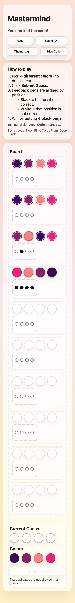
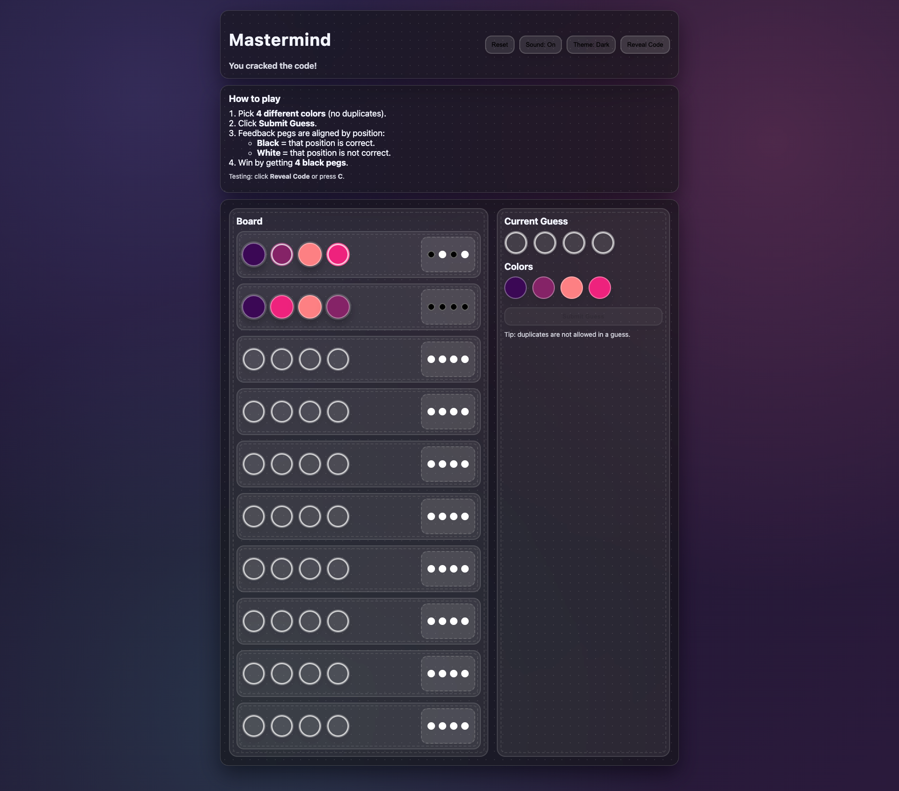
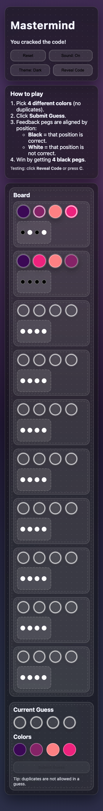

# Mastermind

A browser-based version of the classic Mastermind code-breaking game.  
Players attempt to guess a hidden color code within a limited number of turns using logical deduction and visual feedback.

---

## Play the Game
https://thara-messeroux.github.io/mastermind/

---

## Links
- Deployed game: https://thara-messeroux.github.io/mastermind/
- GitHub repository: https://github.com/thara-messeroux/mastermind
- Project planning document: https://docs.google.com/document/d/1-vCt8NqKgBKU_M18nOPS-z2UCfMSAPc2LiJisvf5W24/edit?usp=sharing

---

## How to Play
- The computer generates a secret color code.
- You have 10 attempts to guess the correct code.
- Click colors to build your guess, then submit it.
- Feedback pegs indicate:
  - Correct color in the correct position
  - Correct color in the wrong position
- Guess the full code before running out of turns to win.

A toggle is available to reveal the secret code for testing purposes.

---

## Project Planning

### Game Choice
**Mastermind**

This project is a browser-based version of the classic Mastermind code-breaking game.  
The player attempts to guess a hidden sequence of colors within a limited number of turns using logic and feedback.

---

### Gameplay Overview (Pseudocode)

**START GAME**
- Generate a secret code made of 4 colors
- Set turn counter to 0
- Set game status to “playing”

**PLAYER BUILDS GUESS**
- Player clicks colors to build a guess of 4 colors
- Display the current guess on the screen

**SUBMIT GUESS**
- Compare the guess to the secret code
- Calculate feedback:
  - Exact matches (correct color in the correct position)
  - Color-only matches (correct color in the wrong position)
- Display feedback to the player
- Increase the turn count

**CHECK GAME STATE**
- If all 4 positions are exact matches:
  - Player wins
  - Display a win message
- Else if the maximum number of turns is reached:
  - Player loses
  - Display a loss message and reveal the secret code
- Otherwise:
  - Allow the player to make another guess

**RESET GAME**
- Clear all guesses and feedback
- Generate a new secret code
- Restart the game

---

### Additional Planning Requirements

**Audio**
- A sound plays when a guess is submitted
- A sound plays when the player wins
- A sound plays when the player loses
- Audio can be toggled on or off by the user

---

## Features
- Win and loss conditions with visual and audio feedback
- Accessible UI with high-contrast colors and readable text
- Sound effects for interactions, wins, and losses
- Reveal-code toggle for testing and demonstrations
- Responsive layout using CSS Grid and Flexbox

---

## Technologies Used
- HTML
- CSS
- JavaScript (DOM manipulation)
- Git and GitHub
- GitHub Pages

---

## Screenshots

### Desktop (light theme, default)

### Mobile (light theme, default)

### Desktop (dark theme)

### Mobile (dark theme)

---

## Attributions
- Game concept inspired by the classic Mastermind board game
- Sound effects from royalty-free sources
- UI inspired by modern soft and pastel interface design

---

## Next Steps
- Add difficulty levels
- Add animations for feedback pegs
- Track scores using localStorage
- Add a timed challenge mode
